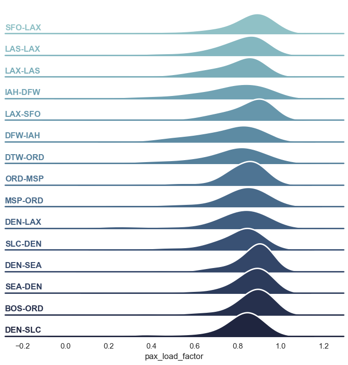

# Passenger Load Prediction Project
This project aims to predict airline passenger load factors based on route characteristics and operational data. Using machine learning techniques such as regression models, cross-validation and hyperparameter optimization, the project identifies patterns that influence route occupancy and evaluates model performance for both existing and new routes.


<br><br>


# Table of Contents
1. [Project Goals](#project-goals)
2. [Data](#data)
3. [Getting started & Requirements](#getting-started--requirements)
4. [Project Structure](#project-structure)
5. [How to Run](#how-to-run)
6. [Notes](#notes)
<br><br>


# Project Goals
- Analyze historical flight and route data to understand key factors influencing passenger load factors
- Develop and benchmark multiple regression models to predict load factors
- Evaluate model performance under two conditions:
    - Existing routes (known patterns) - Standard random split where routes may appear in both training and test data; used as a baseline
    - New routes (previously unseen routes) - A route-based split ensures no overlap between training and test routes, simulating the real-world case of predicting load factors for new airline connections
- Perform hyperparameter tuning to explore model robustness and evaluate trade-offs between complexity and performance
- Derive insights to support decision-making in airline route planning and capacity optimization 
<br><br>


# Data
- Data file: flight_data.csv
- The data used for the analysis has been downloaded from US Bureau of Transportation Statistics: "Air Carriers : T-100 Domestic Segment (All Carriers)", https://www.transtats.bts.gov/DL_SelectFields.aspx?gnoyr_VQ=GEE&QO_fu146_anzr=Nv4%20Pn44vr45
- Filters applied:
    - Filter Geography: All
    - Filter Year: 2024
    - Filter Period: All Months
    - Field Names:
        - DepScheduled
        - DepPerformed
        - Payload
        - Seats
        - Passengers
        - Freight
        - Mail
        - Distance
        - RampTime
        - AirTime
        - UniqueCarrier
        - UniqueCarrierName
        - CarrierGroup
        - OriginAirportID
        - Origin
        - OriginCityName
        - OriginStatesFips 
        - DestAirportID
        - Dest
        - DestCityName
        - DestStateFips
        - AircraftType
        - AircraftConfig
        - Year
        - Month
<br><br>

# Getting started & Requirements

It is recommended to use a virtual environment:<br>
python -m venv .venv <br>
source .venv/bin/activate - on Mac/Linux<br>
or<br>
.venv\Scripts\activate - on Windows

You should have installed Python along with the following libraries:
- pandas
- numpy
- matplotlib
- seaborn
- scikit-learn
- scipy

For detailed version specifications, please refer to the requirements.txt file.
<br>
You can install all dependencies using your preferred environment manager (e.g. pip, conda or uv).
<br><br>

# Project structure
```
project-root/
├── data/
│   └── aircraft_type_mapping.csv
│   └── config_mapping.csv
│   └── fips_codes_mapping.csv
│   └── flight_data.csv
│   └── passenger_load_data.csv
├── model/                              # directory created autom. when saving trained model
├── notebooks/
│   └── 1_eda_cleaning_featureengineering.ipynb
│   └── 2_pax_load_factor_prediction.ipynb
├── .gitignore
├── .python-version
├── image.png                           # visualization for README
├── main.py                             # main script for model execution or prediction
├── pyproject.toml                      # project configuration
├── README.md                                   
├── requirements.txt                    # dependencies
```
<br><br>


# How to Run
1. **Download the dataset**  
   Download the *Air Carriers: T-100 Domestic Segment (All Carriers)* dataset or use the provided file
2. **Open the notebooks** 
    - Notebook **1_eda_cleaning_featureengineering.ipynb**: performs data exploration, cleaning and feature engineering. Outputs a prepared dataset for modeling
    - Notebook **2_pax_load_factor_prediction.ipynb**: Loads the cleaned dataset, trains and evaluates predictive models and presents the final results 
3. **Execute all cells step-by-step**  
   Run the cells in order to reproduce the full workflow and results

❗ **This repo ships with the cleaned dataset (`data/passenger_load_data.csv`) produced by Notebook 1_eda_cleaning_featureengineering.ipynb**

❗ **The trained model (`passenger_load_model.joblib`) is not included due to GitHub file size limits. You can easily regenerate it by running Notebook 2_pax_load_factor_prediction.ipynb, which automatically exports the model after training.**
<br><br>


# Notes

### Datasets
- The notebook **2_pax_load_factor_prediction.ipynb** requires either the cleaned dataset from the first notebook or a custom dataset with at least the following recommended columns used in model training:


    | Column                   | Type          | Description |
    | -------------            | ------------- | -------------
    | `carrier_group`          | categorical   | Airline group
    | `aircraft_type`          | categorical   | Aircraft model
    | `departures_performed`   | numeric       | Number of flights performed
    | `payload`                | numeric       | Total payload weight
    | `freight`                | numeric       | Freight load 
    | `mail`                   | numeric       | Mail load 
    | `distance`               | numeric       | Flight distance 
    | `air_time`               | numeric       | Average flight duration 
    | `pax_load_factor`        | numeric       | Target variable (percentage of seat occupancy)
    | `aircraft_type`          | categorical   | Aircraft model code or category (e.g. A320, B737)
    | `aircraft_config`        | categorical   | Configuration code describing aircraft setup (e.g. passenger, cargo, mixed)
    | `route`                  | categorical   | Origin–destination pair (e.g. “LAX–SFO”)
    | `route_type`             | categorical   | Indicates whether the route is Domestic, International/Unknown


- The model can be adapted to alternative or extended feature sets. To use different predictors, update the preprocessing pipeline and feature selection steps accordingly
- Aircraft type, configuration information and route type were mapped using the provided reference files:
    - aircraft_type_mapping.csv
    - config_mapping.csv
    - fips_codes_mapping.csv


### Models, Hyperparameter Tuning & Evaluation
- The analysis includes multiple regression approaches:
    - Baseline (Mean Predictor)
    - Linear Regression
    - Random Forest
    - Gradient Boosting 

- Both RandomizedSearchCV and GridSearchCV were applied for hyperparameter tuning of the best performing model
- SHAP (SHapley Additive exPlanations) or coefficient analysis was used to analyze feature importance and interpret model predictions
- Model evaluation included cross-validation, R², MAE and RMSE metrics
- New Route evaluation was performed using GroupShuffleSplit and GroupKFold to simulate predictions on unseen routes
- All experiments were conducted using scikit-learn pipelines to ensure reproducibility and clean preprocessing integration

